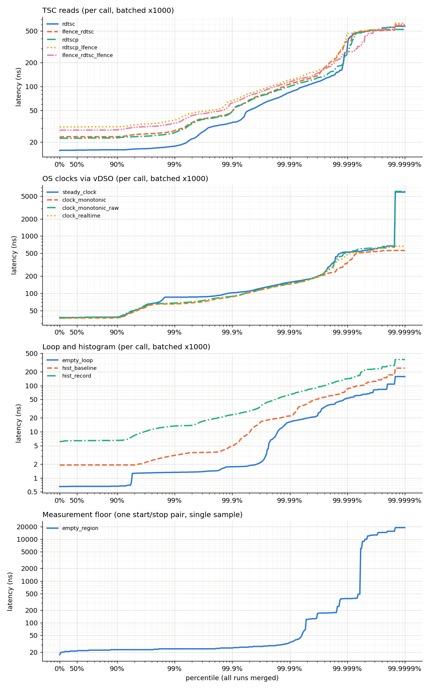

# E0: Measuring the Measurement

> Status: **complete.** Every number below comes from the result files copied to
> [`docs/results/E0/`](../results/E0/) (tables, CSVs, `env.json`, `manifest.json`). The
> hypotheses were written before the tuned runs and are left unchanged. A short untuned
> smoke run made while developing the drivers is not used anywhere.
>
> Commit IDs below are the pre-rewrite IDs recorded in the result files; see
> [`docs/git-history.md`](../git-history.md) for the current ones (`7291ce5` is now `083cfda`).

## Question

Every later latency number is a difference of two timestamps. Before trusting any of them:

1. What does reading the time cost, for each available clock, in core cycles and ns?
2. What is the smallest interval the project's start/stop stamp pair can report (the
   measurement floor that every stage latency includes)?
3. Can a TSC stamp taken on one core be subtracted from a stamp taken on another core,
   and to what accuracy?
4. What does recording one sample into the log-linear histogram cost?

## Hypotheses (expected mechanism), written before the tuned runs

**H1. Raw TSC reads.** `rdtsc` is a microcoded instruction (about 20 µops on Skylake-family
cores), so back-to-back calls are limited by microcode throughput, roughly 25 core cycles
each (Agner Fog's instruction tables list a reciprocal throughput of ~25 for Skylake).
`rdtscp` additionally waits for all earlier instructions to finish and reads `IA32_TSC_AUX`,
so it should cost more (~30–40 cycles). Adding `lfence` makes each read wait for the
previous one to complete; we expect `lfence;rdtsc` and `rdtscp;lfence` to cost about the
same as `rdtscp`, and `lfence;rdtsc;lfence` slightly more.

**H2. OS clocks.** On this kernel `clock_gettime(CLOCK_MONOTONIC / CLOCK_MONOTONIC_RAW /
CLOCK_REALTIME)` and `std::chrono::steady_clock::now()` (which calls
`clock_gettime(CLOCK_MONOTONIC)`) are served by the **vDSO** in user space, without a
system call. A vDSO read is: read a sequence counter, an ordered TSC read, a multiply and
shift to convert ticks to ns, re-check the sequence counter. We expect about 2× the cost of
an ordered TSC read (~50–70 cycles), all four clocks within a few cycles of each other, and
`steady_clock` equal to `CLOCK_MONOTONIC` (it is a thin wrapper).

**H3. Measurement floor.** An empty start/stop region costs the latency of the fenced pair,
not the throughput: about 30–50 core cycles. The floor in **TSC ticks** depends on the core
frequency, because the work is done in core cycles but counted at the fixed 1.8 GHz TSC rate.

**H4. Core frequency under the baseline tuning.** With `no_turbo=1` and the `performance`
governor, the core should run at its maximum non-turbo ratio. For the i5-8250U the
marketed base clock is 1.6 GHz, but the TSC runs at 1.8 GHz; we expect the core to run at
1.8 GHz (the platform's P1 ratio), so that TSC ticks ≈ core cycles in tuned runs. The
measured "core GHz" (cycles / time in the region) tests this.

**H5. Cross-core TSC skew.** The kernel synchronizes the TSCs of all cores at boot and the
`TSC_ADJUST` MSR keeps them aligned, so the true offset between any two logical CPUs should
be 0 within the measurement bound. The bound (RTT/2 of a cache-line ping-pong) should be
smallest for SMT siblings (n, n+4: the line stays in the shared L1/L2) and larger for
different physical cores (the line moves through the shared L3 / ring).
A single-direction NTP estimate can show a non-zero "offset" caused by an asymmetric
measurement path rather than real skew. Measuring both directions (A→B and B→A) separates
the two: real skew flips sign with the direction, asymmetry does not.

**H6. Histogram record.** `record()` is a `lzcnt`, a shift, an add, an increment of one
bucket in memory, a count, a sum and min/max updates: about 10–15 instructions. Throughput
should be limited by the loop-carried dependency through memory on `count_`/`sum_` (store,
then reload in the next iteration via store-to-load forwarding, ~4–5 cycles), so we expect
roughly 5–8 cycles per record over the `hist_baseline` loop.

## Setup

From `env.json` (captured by `scripts/run_bench.py` before and after each session):

| item | value |
|---|---|
| CPU | Intel Core i5-8250U (Kaby Lake R), 4 cores / 8 threads, SMT siblings n / n+4, microcode `0xf6` |
| TSC | invariant (`constant_tsc`, `nonstop_tsc`), 1.8000 GHz (calibrated against `CLOCK_MONOTONIC_RAW` for 1 s in every run) |
| kernel | 6.16.8+kali-amd64, cmdline `ro quiet splash` (no `isolcpus` / `nohz_full`), clocksource `tsc` |
| tuning | `scripts/tune_machine.sh apply`: `intel_pstate` with `performance` governor and EPP, `no_turbo=1`, `nmi_watchdog=0`, irqbalance inactive, on AC power |
| build | `release` preset: GCC 15.2.0, `-O2 -DNDEBUG` |
| source | git `7291ce5`, clean tree when built and when each session started |
| pinning | `e0_timers` on CPU 2; `e0_skew` pins its two threads to the pair under test |

Git provenance note: the per-run `*.meta.json` files of the timer session show
`build.git_sha = 7f96642`. That value was baked in when CMake was configured and was not
refreshed when `7291ce5` was built (fixed in the next commit: build info is now regenerated
at build time and records a dirty flag). The binaries themselves were built from the clean
`7291ce5` tree, as `manifest.json` and the "before" block of `env.json` record. The "after"
block of the timer session's `env.json` shows `git_dirty: true` because P1 source files were
being edited while the benchmark was running; that does not change the already-built
binaries. The skew and histogram-counter sessions were run with those edits stashed, so both
of their `env.json` blocks show a clean `7291ce5`.

## Variants

| driver | variant | what one operation is |
|---|---|---|
| `e0_timers` | `rdtsc` | `rdtsc` |
| | `lfence_rdtsc` | `lfence; rdtsc` (the project's start stamp) |
| | `rdtscp` | `rdtscp` |
| | `rdtscp_lfence` | `rdtscp; lfence` (the project's end stamp) |
| | `lfence_rdtsc_lfence` | `lfence; rdtsc; lfence` |
| | `steady_clock` | `std::chrono::steady_clock::now()` |
| | `clock_monotonic` | `clock_gettime(CLOCK_MONOTONIC)` |
| | `clock_monotonic_raw` | `clock_gettime(CLOCK_MONOTONIC_RAW)` |
| | `clock_realtime` | `clock_gettime(CLOCK_REALTIME)` |
| | `empty_loop` | the loop with no clock call (overhead baseline) |
| | `empty_region` | one start stamp then one end stamp (single sample, not batched) |
| | `hist_record` | `Histogram::record(v)`, v from a precomputed log-normal array |
| | `hist_baseline` | same loop, summing v instead of recording it |
| `e0_skew` | all ordered CPU pairs | one ping-pong round trip |

## Method

- Per-call variants: 200 000 batches of K = 1 000 back-to-back calls per run, each batch
  bracketed by one start/stop pair; the batch time divided by K is one sample. Batching
  amortizes the bracket overhead, so this measures the **throughput cost** of a call
  (how much a call slows down a loop that makes many of them), not the latency of a single
  isolated call. The single-call cost is what `empty_region` shows.
- Hardware counters (cycles, instructions, ref-cycles) around the measured batches only.
- 10 runs per variant, interleaved, plus one discarded warm-up pass; median across runs
  with 95% bootstrap CI (`docs/methodology.md`).
- Skew: 200 000 round trips per ordered pair per run (after 10 000 warm-up), 10 runs.
  The offset estimate uses the 1% of samples with the smallest RTT (tightest bound).

## Results

Medians across 10 runs, with the 95% bootstrap CI of the median in brackets. Batched
variants: one sample = (time for 1 000 calls) / 1 000, so their percentiles describe
1 000-call windows. Full tables: [`timers-summary.md`](../results/E0/timers-summary.md),
[`timers-summary.csv`](../results/E0/timers-summary.csv).

### Cost of reading the time (throughput, per call)

| variant | p50 ns | p99 ns | core cycles / call | instructions / call | IPC |
|---|---|---|---|---|---|
| `rdtsc` | 15.9 [15.9, 15.9] | 17.7 [17.6, 18.3] | 25.6 [25.6, 25.7] | 7.08 | 0.28 |
| `rdtscp` | 22.5 [22.5, 22.5] | 26.4 [25.8, 27.0] | 36.3 [36.2, 36.3] | 9.10 | 0.25 |
| `lfence; rdtsc` (start stamp) | 23.5 [23.5, 23.5] | 27.6 [27.5, 28.1] | 37.7 [37.6, 37.8] | 8.09 | 0.22 |
| `lfence; rdtsc; lfence` | 28.4 [28.4, 28.4] | 34.5 [34.2, 35.1] | 45.9 [45.8, 46.0] | 9.11 | 0.20 |
| `rdtscp; lfence` (stop stamp) | 31.1 [31.1, 31.1] | 37.7 [37.3, 38.7] | 50.2 [50.1, 50.2] | 10.1 | 0.20 |
| `clock_gettime(CLOCK_REALTIME)` | 37.0 [37.0, 37.0] | 65.1 [64.9, 65.7] | 60.7 [60.1, 61.3] | 78.2 | 1.29 |
| `clock_gettime(CLOCK_MONOTONIC)` | 37.3 [37.3, 37.3] | 65.4 [65.4, 65.8] | 61.3 [60.8, 61.5] | 78.2 | 1.28 |
| `clock_gettime(CLOCK_MONOTONIC_RAW)` | 37.8 [37.8, 37.8] | 67.7 [67.1, 68.3] | 62.7 [62.4, 62.9] | 84.2 | 1.34 |
| `std::chrono::steady_clock::now()` | 37.8 [37.8, 37.8] | 85.9 [85.9, 85.9] | 63.0 [62.7, 63.6] | 82.2 | 1.30 |
| empty loop (baseline) | 0.657 [0.657, 0.657] | 1.30 [0.99, 1.32] | 1.16 [1.14, 1.17] | 3.06 | 2.64 |

The cycle and instruction counts are per call, from the hardware counters around the timed
batches only. The loop itself costs about 1 cycle per iteration, so it barely affects the
clock numbers.

### Measurement floor (single start/stop pair, no batching)

| variant | min ns | p50 ns | p99 ns | p99.9 ns | max ns |
|---|---|---|---|---|---|
| `empty_region` | 18.3 [17.8, 18.3] | 21.1 [21.1, 21.1] | 23.9 [23.9, 23.9] | 23.9 [23.9, 25.6] | 13 413 [4 440, 26 553] |

The p50 is **38 TSC ticks** in every run (21.1 ns; about 34 core cycles at the measured
1.593 GHz). This is the smallest interval a `Tsc::start()` / `Tsc::stop()` pair reports, and
it is included in every stage latency measured later. Across all 2 000 000 samples of the 10
runs, 104 were above 100 ns and 12 were above 5 µs (the max column). The single-sample
tail is discussed under Threats to validity.

### Histogram record

| variant | p50 ns | cycles / op | instructions / op | IPC | branch misses / op | L1D load misses / op |
|---|---|---|---|---|---|---|
| `hist_baseline` (load + add) | 1.91 [1.91, 1.91] | 3.17 [3.15, 3.20] | 9.05 | 2.86 | 0.001 | 0.000 |
| `hist_record` | 6.40 [6.40, 6.42] | 10.6 [10.4, 10.9] | 30.9 | 2.92 | 0.005 | 0.003 |

`record()` costs **about 4.5 ns (7.4 core cycles, 21.9 instructions) per call** over the
loop that only loads the value. The branch-miss and L1D columns come from a separate
10-run session with those counters enabled ([`hist-counters-summary.md`](../results/E0/hist-counters-summary.md));
its cycles/op (3.22 and 10.8) match the main session within about 2%.

### Cross-core TSC agreement (`e0_skew`)

All 56 ordered CPU pairs, 200 000 round trips each per run, 10 runs (112 million round
trips in total). Per unordered pair, the two directions are combined:
skew = (offset<sub>A→B</sub> − offset<sub>B→A</sub>) / 2 cancels a measurement-path asymmetry, and
asymmetry = (offset<sub>A→B</sub> + offset<sub>B→A</sub>) / 2 is what is left over.
Full table: [`skew.md`](../results/E0/skew.md).

| relation (pairs) | skew estimate, range over pairs | asymmetry | bound (RTT/2, best 1%) | one-way p50 (RTT/2) | violations |
|---|---|---|---|---|---|
| SMT siblings (4) | 0.000 … 0.139 ns | −7.5 … −7.8 ns | 59.2 ns | 76.5 … 76.7 ns | 0 |
| different physical cores (24) | −2.22 … +1.53 ns | −8.0 … −11.3 ns | 135.7 … 145.3 ns | 187.4 … 189.8 ns | 0 |

- **No round trip violated causality**: in all 112 million samples the responder's stamp
  fell inside the initiator's [t0, t3] window. So any real offset between two TSCs is
  smaller than the bound (59 ns for SMT siblings, ≤ 145 ns across cores).
- The two-direction estimate is much tighter than that bound: |skew| ≤ 2.2 ns for every pair.
  For 3 of the 28 pairs (0-7, 1-3, 4-5) the bootstrap CI excludes 0, at magnitudes of 1.0 to
  1.9 ns (2 to 4 TSC ticks). We do not read these as real offsets, because the method's own
  systematic error (legs of slightly different work, below) is of that size.
- One-way cache-line hand-off as measured by this ping-pong: **~77 ns between SMT siblings,
  ~188 ns between physical cores** (at 1.6 GHz). See Threats to validity: this includes the
  spin loop's reaction time, not only the line transfer.



*Percentile curves per variant, all 10 runs merged (log–log). The tables above are the
accessible view of the same data.*

## Counter evidence

- **Core frequency.** `cycles / time_running` = **1.593 GHz** in every variant
  (CI [1.591, 1.595]), while `ref-cycles` (which count at the TSC rate) give 1.796 GHz.
  The cores ran at 1.6 GHz, not at the 1.8 GHz TSC rate. `intel_pstate` reports
  `base_frequency = cpuinfo_max_freq = 1 600 000 kHz` with `no_turbo=1`. Consequence for
  every later experiment: **1 core cycle = 1.125 TSC ticks** under the baseline tuning, so
  results are reported in ns (or core cycles from the counters), never "ticks = cycles".
- **TSC reads are microcode-bound, not instruction-bound.** `rdtsc` retires 7 instructions
  per loop iteration (the instruction, `shl`/`or` to combine edx:eax, the sink add, the loop)
  yet takes 25.6 cycles: IPC 0.28. That matches a microcoded instruction with a reciprocal
  throughput of about 25 cycles. Each added `lfence` or the `rdtscp` form adds 11–25 cycles over `rdtsc`
  for 1–3 extra instructions (IPC falls to 0.20): the cost is waiting (serialization), not
  work.
- **vDSO clocks do work, not waiting.** 78–84 instructions per call at IPC ≈ 1.3, about
  61–63 cycles, with no system call (a syscall would cost hundreds of cycles plus the
  mode switch). The four clocks are within 2.3 cycles of each other.
  - `steady_clock::now()` = `clock_gettime(CLOCK_MONOTONIC)` + 4.0 instructions and
    +1.7 cycles (CIs do not overlap). Disassembly of libstdc++'s
    `std::chrono::_V2::steady_clock::now()` shows why: it is an out-of-line function
    (`endbr64`, stack adjust, `call clock_gettime@plt`, `imul`/`add` to build ns, `ret`), so
    our direct call skips one call/return layer that it pays.
  - `CLOCK_MONOTONIC_RAW` executes 6 more instructions than `CLOCK_MONOTONIC` (+1.4 cycles).
    We did not trace the vDSO to attribute those 6 instructions.
- **Histogram record.** The release disassembly of the `hist_record` loop has 34
  instructions on the log-bucket path and 27 when the value is below 128 (linear buckets,
  7 instructions skipped). With the log-normal(5, 1) input, P(v < 128) ≈ 0.44, so the
  expected count is 34 − 0.44 × 7 ≈ 30.9 instructions, which **matches the measured 30.9**.
  Branch misses (0.005 / op) and L1D misses (0.003 / op) are negligible, so neither
  explains the 7.4 extra cycles. What remains is data dependence through memory: `count_`,
  `sum_`, `min_`, `max_` and the bucket counter are read-modify-written in memory on every
  call (`min_`/`max_` as load → `cmp` → `cmov` → store). Each such chain carries a
  store-to-load forwarding latency into the next call. This attribution is an inference from
  the instruction mix; it was not confirmed with a top-down measurement (planned with toplev
  in P2).
- **Measurement floor.** The `empty_region` counters cover the whole loop iteration
  (stamp pair + `record()` + loop): 97.1 cycles and 42.2 instructions per iteration, IPC
  0.43. The region itself (start stamp to stop stamp) is 38 ticks ≈ 34 cycles. The fences
  serialize every iteration, so the record and the next start stamp cannot overlap.
  **Instrumenting one message with a start/stop pair and a `record()` therefore costs about
  97 cycles ≈ 61 ns of the thread's time at 1.6 GHz**, which is why the hot path in later
  phases must not record a histogram sample per stage per message without measuring this
  overhead.

## Where the hypothesis was wrong

- **H4 (core at 1.8 GHz): wrong.** With `no_turbo=1` and the `performance` governor the cores
  ran at 1.593 GHz (counters) and `intel_pstate` caps them at 1.6 GHz, the SKU's marketed
  base clock. The TSC runs at 1.8 GHz, which is **not** the core's maximum non-turbo
  frequency on this machine. TSC ticks ≈ core cycles does not hold; the ratio is 1.125. We
  did not read the model-specific registers to find out where the 1.8 GHz TSC rate comes
  from.
- **H1, partly wrong.** The raw costs were as predicted: `rdtsc` 25.6 cycles (predicted
  ~25) and `rdtscp` 36.3 cycles (predicted 30–40), and `lfence; rdtsc` (37.7) costs about the
  same as `rdtscp`. But `rdtscp; lfence` (50.2 cycles) is **not** about the same as `rdtscp`.
  It is the most expensive TSC variant, costlier than `lfence; rdtsc; lfence` (45.9), which
  we expected to be the most expensive. The trailing `lfence` costs 13.9 cycles after
  `rdtscp` but only 8.2 after `lfence; rdtsc`. These counters cannot attribute that
  difference further.
- **H6, wrong on the instruction count, right on the cost.** `record()` executes about 22
  instructions over the baseline, not 10–15: `min_` and `max_` compile to memory
  load/compare/conditional-move/store sequences, and the log-bucket index needs 7 more
  instructions than the linear one. The 5–8 cycle prediction held (7.4 cycles). We also
  expected the linear-versus-log branch to mispredict on random values; it did not (0.005
  misses per record), because the input repeats every 1 000 calls and the branch predictor
  learns the sequence. Real latency values do not repeat, so this measurement is a lower
  bound for the cost with unpredictable inputs (see Threats).
- **H2: right in mechanism and magnitude** (vDSO, 61–63 cycles, within a few cycles of each
  other). `steady_clock` is not literally equal to `CLOCK_MONOTONIC`: it costs 1.7 cycles
  more, for the call layer explained above.
- **H3 and H5: as predicted.** The floor is 34 core cycles (predicted 30–50). There is no
  detectable skew, the SMT-sibling bound is smaller than the cross-core bound, and the
  asymmetry keeps its sign when the direction is reversed (−7.5 to −11.3 ns for every pair,
  in both directions). That shows it is a property of the measurement path, not of the
  clocks.

## Conclusion

For this machine, kernel and build (workload-specific):

1. The project's stamp pair (`lfence; rdtsc` start, `rdtscp; lfence` stop) has a floor of
   **38 TSC ticks = 21.1 ns** (p50; p99 23.9 ns). Latencies near this size are not
   resolvable. Reports state the floor next to small stage numbers.
2. Back-to-back, the start stamp costs 37.7 and the stop stamp 50.2 core cycles of
   throughput, about 4× and 6× a raw `rdtsc`. The vDSO clocks cost 61–63 cycles and give
   no benefit for intervals, so they are used only for wall-clock conversion and TSC
   calibration.
3. **TSC stamps from different cores can be subtracted.** No skew was detected (all 28
   pairs within ±2.2 ns; 0 violations in 112 M round trips). Cross-core stage latencies in
   E4 and later are valid to within a few ns of skew, which is negligible next to the
   ~190 ns cross-core hand-off measured here.
4. Histogram `record()` costs ~4.5 ns (7.4 cycles) when its branch is predictable. A fully
   instrumented message (stamp pair + record) costs ~97 cycles ≈ 61 ns of thread time.
   Later hot paths budget for this instrumentation cost or sample it.
5. Under the baseline tuning the cores run at **1.6 GHz** while the TSC counts at 1.8 GHz.
   All cycle claims come from hardware counters, not from TSC ticks.

## Threats to validity

- The **cores run at 1.6 GHz with turbo off**. Absolute ns numbers do not transfer to turbo
  operation (up to 3.4 GHz on this SKU). Cycle counts transfer better, except for anything
  that crosses the uncore (cache-line hand-off between cores).
- The **ping-pong one-way time (~77 / ~188 ns) is not the raw cache-line transfer
  latency.** Each side spins with `pause` (`_mm_pause`), and on Skylake-family cores one
  `pause` lasts much longer than on older cores (Intel's optimization manual documents an
  increase to as many as ~140 cycles), so the waiting side may notice the new value up to a
  `pause` late. It also includes the `lfence; rdtsc; lfence` stamp on each side. E3
  measures queue hand-off cost with and without `pause`. The skew estimate is unaffected,
  because a late reaction lengthens the RTT but cannot move the responder's stamp outside
  [t0, t3].
- `empty_region` tail: 12 of 2 000 000 samples were above 5 µs. The measured CPU was not
  isolated (`isolcpus` / `nohz_full` not set), so timer ticks and other interrupts land in
  the measured window. Each run's `empty_region` loop lasts only ~12 ms (200 000 iterations
  × ~61 ns), so these tail numbers rest on very few events. Interrupt attribution
  (`rtla osnoise` / `timerlat`) is part of E6.
- The `hist_record` input repeats every 1 000 values, so the bucket-path branch is learned
  by the predictor. Production latency values are not periodic; expect occasional
  mispredicts (on the order of 15–20 cycles each on this core) on top of the 7.4 cycles
  measured here.
- Batched per-call costs are throughput numbers; a single call in cold code can cost more
  (instruction-cache and microcode-sequencer warm-up).
- The batch average hides per-call variation, so tail percentiles of the batched variants
  describe 1 000-call windows, not single calls. Single-call tails come from `empty_region`.
- vDSO behaviour depends on the kernel's clocksource (`tsc` here, recorded in `env.json`).
  With a different clocksource (e.g. `hpet`) `clock_gettime` becomes a system call and
  costs far more.
- Results are for this CPU (Kaby Lake R microcode `0xf6`), this kernel and this compiler.

## Reproduce

```bash
sudo scripts/tune_machine.sh apply          # performance governor, no_turbo=1, nmi_watchdog=0
cmake --preset release && cmake --build --preset release

# Timer variants (13), N = 10 interleaved runs + 1 warm-up pass
python3 scripts/run_bench.py --name E0-timers --build build/release --runs 10 \
  --cmd "{bin}/apps/e0_timers --variant {variant} --cpu 2 --out {out}" \
  --param variant=rdtsc,lfence_rdtsc,rdtscp,rdtscp_lfence,lfence_rdtsc_lfence,steady_clock,clock_monotonic,clock_monotonic_raw,clock_realtime,empty_loop,empty_region,hist_record,hist_baseline
python3 scripts/analyse.py summary results/E0-timers/latest --panels \
  "TSC reads (per call, batched x1000):rdtsc,lfence_rdtsc,rdtscp,rdtscp_lfence,lfence_rdtsc_lfence;OS clocks via vDSO (per call, batched x1000):steady_clock,clock_monotonic,clock_monotonic_raw,clock_realtime;Loop and histogram (per call, batched x1000):empty_loop,hist_baseline,hist_record;Measurement floor (one start/stop pair, single sample):empty_region"

# Histogram record with branch / L1D counters
python3 scripts/run_bench.py --name E0-hist-counters --build build/release --runs 10 --no-build \
  --cmd "{bin}/apps/e0_timers --variant {variant} --cpu 2 --counters cycles,instructions,branch-misses,L1-dcache-load-misses --out {out}" \
  --param variant=hist_record,hist_baseline
python3 scripts/analyse.py summary results/E0-hist-counters/latest

# Cross-core skew, all ordered pairs
python3 scripts/run_bench.py --name E0-skew --build build/release --runs 10 --no-build \
  --cmd "{bin}/apps/e0_skew --pairs {pairs} --out {out}" --param pairs=all
python3 scripts/analyse.py skew results/E0-skew/latest

sudo scripts/tune_machine.sh restore
```

The runs reported here: `results/E0-timers/20261003T215259Z`,
`results/E0-hist-counters/20261003T221418Z`, `results/E0-skew/20261003T221107Z`
(timestamps UTC), all built from git `7291ce5`. The curated copies are in `docs/results/E0/`.
