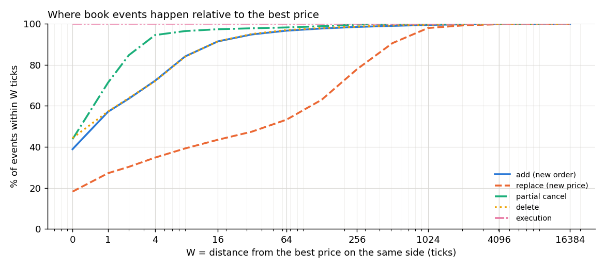
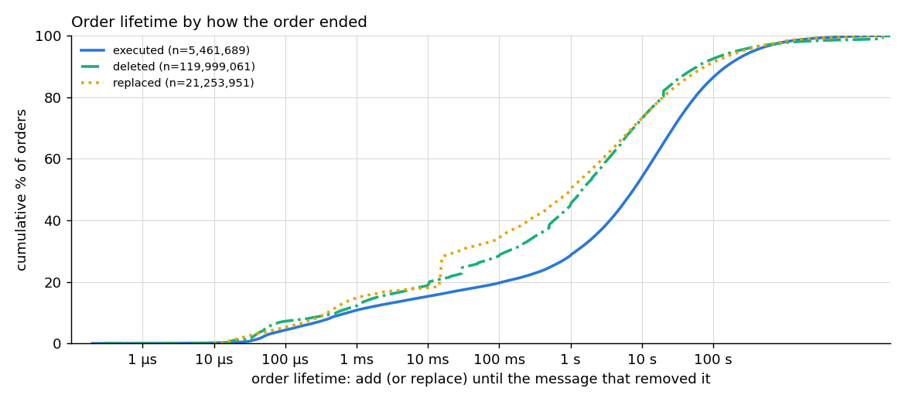
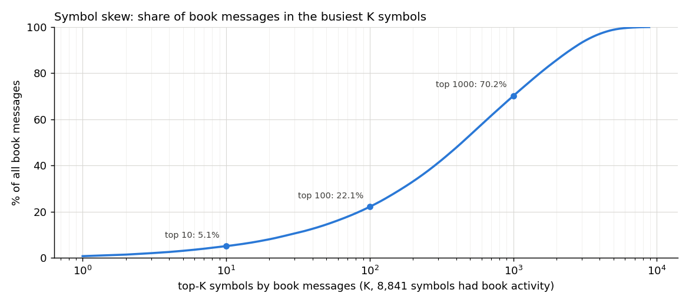
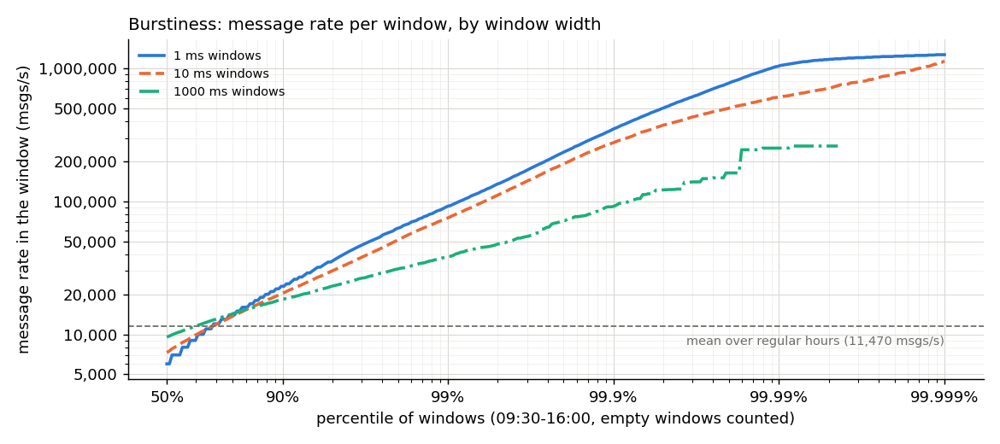

# E1: What a Real ITCH Day Looks Like

> Status: **complete.** Every number below comes from one pass of `e1_workload` over the
> full Nasdaq TotalView-ITCH 5.0 file for 2019-07-30, copied to
> [`docs/results/E1/`](../results/E1/) (summary JSON, histograms, tables, plots, `env.json`).
> E1 measures the **data**, not the speed of our code: there are no latency numbers here.
> The wall time printed by the tool is untuned and informational only.

## Question

Phase 2 builds an optimized order book. Every one of its design choices depends on what the
messages actually look like, so they are measured first:

1. **Message mix:** which messages dominate, and what are the add / cancel / execute ratios?
2. **Price locality:** how far from the best price do adds, cancels, deletes, executions and
   replaces happen? This sizes the tick ladder (P2 layer L2, "±W ticks around the best").
3. **Order refs:** are order reference numbers dense enough to index a plain array (a
   "direct vector"), or is a hash map needed (P2 layer L3)?
4. **Sizes:** how many orders are live at the peak (object-pool size), how many price levels
   does a book side have, how many orders share one level?
5. **Order lifetimes:** how long does an order rest before it is executed, deleted or replaced?
6. **Symbol skew:** how concentrated is the activity across symbols?
7. **Burstiness:** how far above the average rate do 1 ms / 10 ms / 1 s peaks go? This sets the
   offered-load range of E4 (threading models) and E5 (network feed).
8. **Correctness on real data:** does the reference book process the whole day with zero
   anomalies (unknown refs, overfills, empty or mis-ordered levels)? Are crossed or locked
   books explained?

## Hypotheses (prior design assumptions)

Honest framing: E1 characterizes data; it has no "variant A vs B" to predict, and a first
full-day pass of the tool (used to debug it) was seen before this write-up. So the
statements below are **the plan's design assumptions as they stood before any real data was
processed** (`plan.md`, master plan §7 P1/P2), not blind predictions. E1 tests them.

- **A1. Activity is near the touch.** Most book events happen within a few ticks of the best
  price, so a small fixed ladder of ±W ticks per book side catches nearly all of them, with a
  rarely used sparse fallback for far prices.
- **A2. Replaces behave like adds.** A replace (`U`) moves an order to a new price near the
  best, like a fresh add.
- **A3. Order refs might be dense.** The plan left "a direct vector if E1 shows dense refs"
  open as an alternative to an open-addressing hash map.
- **A4. A few symbols dominate.** The plan uses a "top-symbol slice" as a representative
  input for E2, which assumes a small set of symbols carries most of the traffic.
- **A5. Bursts are far above the mean**, so the average rate is not the right load for E4.
- **A6. Crossed books are legitimate only before the open / during halts.** (Stated in the
  first version of `docs/itch-moldudp64.md` §4: "e.g. before the opening cross".)

## Setup

| item | value |
|---|---|
| input | `data/07302019.NASDAQ_ITCH50.gz` (3 662 140 094 bytes, sha256 pinned in `data/checksums.sha256`), fetched by `scripts/fetch_itch.sh`; streamed, never loaded |
| machine | Intel Core i5-8250U, 7.6 GiB RAM, kernel 6.16.8+kali-amd64 (`env.json`) |
| build | `release` preset: GCC 15.2.0, `-O2 -DNDEBUG`, git `a4102bd`, clean tree |
| tool | `apps/e1/e1_workload.cpp`: the day is streamed once through the **reference book** (`std::map` levels, `std::list` orders, `std::unordered_map` refs); statistics are gathered beside it |
| regular hours | 09:30:00–16:00:00 (34 200–57 600 s after midnight, the timestamps in the file); 2019-07-30 was a normal full trading day |

Tuning state does not matter for E1 (no timing is reported); it is recorded in `env.json`
anyway.

## Method

- **One pass, deterministic.** The input is a fixed file and the tool has no randomness, so
  repeated passes give identical statistics. This was checked: three complete passes (two
  during development, one for the result) produced the same values in every field of
  `summary.json` except build provenance, peak RSS (379.9–380.2 MiB) and wall time. N ≥ 10 runs and
  bootstrap CIs (`docs/methodology.md`) apply to timing experiments, not here.
- **Histograms.** Distributions are recorded into the project's log-linear histogram
  (values below 128 exact, otherwise < 0.79% relative bucket width). Percentiles reported from
  them are **bucket upper bounds** (never smaller than the true value). "Share within X"
  counts only buckets entirely ≤ X, so it is a lower bound.
- **Distance from best.** For each add, the new price of each replace, and each order removed
  or reduced (execute, partial cancel, delete), the distance in ticks to the best price **on
  the same side**, read from the book **before** the event. Tick = $0.01 at or above $1.00,
  $0.0001 below (Nasdaq's minimum increment). Behind the best and improving it are both
  counted by absolute distance. Events on an empty side (no best) are counted separately
  (87 098 adds).
- **Burstiness.** Messages (all types) per fixed window of feed time, 09:30–16:00, windows
  aligned to 09:30:00, **empty windows included** (23.4 M one-ms windows).
- **Lifetimes.** From the add (or the replace that created the order's ref) to the message
  that removed it, split by how it ended.
- **Depth snapshots.** Every 30 min of feed time, every non-empty book side: number of price
  levels, orders per level; plus a full-depth invariant check of every side.
- **Invariants.** After every book message: top-of-book crossed/locked check, split into
  outside regular hours / regular hours and the symbol trading / regular hours and the symbol
  not trading (state from `H` messages). Every hit is logged with its timestamp, symbol,
  message type and trading state, so each one can be explained. At each snapshot: no level
  with 0 shares or 0 orders, levels strictly ordered best-first.

## Results

Full tables (generated): [`e1-tables.md`](../results/E1/e1-tables.md). Raw summary:
[`summary.json`](../results/E1/summary.json).

### Correctness of the reference book on the full day

| check | result |
|---|---|
| messages processed | 282 229 684 |
| peak resident memory | 380.0 MiB (streaming reader, 8 MiB buffer; RAM budget 7.6 GiB) |
| unknown refs, duplicate refs, overfills, zero-qty adds, bad/mismatched locates | 0, 0, 0, 0, 0 |
| timestamp regressions | 0 |
| live orders at end of day | 0 (every order added was removed) |
| empty or mis-ordered levels (1 966 080 book sides checked at 15 snapshots) | 0, 0 |
| crossed/locked tops | 989, **all explained** ([below](#crossed-and-locked-books)) |

### Message mix

| type | meaning | count | share |
|---|---|---:|---:|
| `A` | add order | 124 164 371 | 43.99% |
| `D` | delete order | 119 999 061 | 42.52% |
| `U` | replace order | 21 253 951 | 7.53% |
| `E` | order executed | 7 582 422 | 2.69% |
| `I` | net order imbalance (auctions) | 3 723 793 | 1.32% |
| `X` | partial cancel | 2 358 032 | 0.84% |
| `P` | trade vs. hidden order | 1 461 010 | 0.52% |
| `F` | add order with MPID | 1 296 379 | 0.46% |
| `C` | executed with price | 135 573 | 0.05% |
| others (`L`, `Q`, `Y`, `H`, `R`, `S`, `J`, `V`) | | 455 092 | 0.16% |

Book-changing messages (`A F E C X D U`) are **98.07%** of the stream. Per add (`A`+`F`,
125.46 M): 0.956 deletes, 0.169 replaces, 0.062 executions (`E`+`C`, 7.72 M), 0.019 partial
cancels. Roughly **16 adds per execution**: the book mostly churns, it rarely trades.
No `X` ever removed a whole order: Nasdaq always sends `D` for that.

### Price locality: distance from the best on the same side



| event | at best (W=0) | ≤ 16 ticks | ≤ 64 | ≤ 256 | ≤ 1024 | ≤ 4096 |
|---|---:|---:|---:|---:|---:|---:|
| add | 38.86% | 91.35% | 96.59% | 98.42% | 99.39% | 99.83% |
| delete | 44.29% | 91.41% | 96.86% | 98.57% | 99.49% | 99.84% |
| partial cancel | 43.75% | 97.29% | 98.16% | 99.55% | 99.97% | 99.99% |
| execution | 100.00% | 100.00% | 100.00% | 100.00% | 100.00% | 100.00% |
| replace (new price) | 18.19% | 43.44% | 53.25% | 77.83% | 97.87% | 99.72% |

Adds behind the best: p50 1 tick, p99 523, max 1 999 999 860 ticks. Adds improving the best:
p50 1, p99 891. The far tail is real: many symbols carry **stub quotes** (market-maker
placeholder orders far from the market, e.g. AAPL's lowest bid of the day was $0.0001 and its
highest ask $199 999.99), so the day's price range per symbol, counted in ticks of its lowest
price, has a median of ~2 × 10⁹ ticks (`e1-tables.md`). A ladder can never cover the whole
range.

### Order refs

| | value |
|---|---|
| distinct refs (adds + replace new refs) | 146 714 701 |
| range | 12 … 259 540 603 |
| density (distinct / range) | 0.565 |
| **peak live orders** | **1 964 977** |

### Book shape (snapshots every 30 min, 10:00–16:00)

| | value (stable through the day) |
|---|---|
| non-empty book sides | ~17 680 |
| levels per side | p50 28, p90 ~82, p99 ~283, max 2 459–3 070 |
| orders per level | p50 1, p99 22–24, max 2 098–2 399 |
| live orders | 1.70 M – 1.91 M |

### Order lifetimes



| ended by | orders | ≤ 100 µs | ≤ 1 ms | ≤ 1 s | p50 | p90 | p99 |
|---|---:|---:|---:|---:|---:|---:|---:|
| fully executed | 5 461 689 | 4.3% | 10.8% | 28.6% | 7.68 s | 154 s | 2 319 s |
| deleted | 119 999 061 | 7.2% | 12.2% | 44.9% | 1.47 s | 60.1 s | 22 540 s |
| replaced | 21 253 951 | 5.3% | 14.8% | 49.8% | 1.01 s | 78.4 s | 2 233 s |

The longest-lived order rested 57 600 s (16 h: from the 04:00 pre-market start to the 20:00
end of the post-market session).

### Symbol skew



8 841 symbols had book activity. The busiest (SPY) carried 2.11 M book messages, **0.76%** of
the total. The top 10 symbols carry 5.1%, the top 100 22.1%, the top 1 000 70.2%; half of all
book messages are spread over 440 symbols, 90% over 2 492.

### Burstiness



| window | windows | mean | p50 | p99 | p99.9 | max | max / mean |
|---|---:|---:|---:|---:|---:|---:|---:|
| 1 ms | 23 400 000 | 11.47 msgs (11 470 msg/s) | 6 | 92 | 349 | 2 004 msgs (2.0 M msg/s) | 175× |
| 10 ms | 2 340 000 | 114.7 msgs | 73 | 755 | 2 767 | 12 913 msgs (1.29 M msg/s) | 113× |
| 1 s | 23 400 | 11 470 msgs | 9 535 | 38 399 | 92 159 | 512 843 msgs | 45× |

(p-values are bucket upper bounds; mean and max are exact.)

### Crossed and locked books

989 tops were crossed or locked at some point. Every one was traced to its cause using the
per-hit log and a per-symbol slice (`tools/slice_itch --symbols`):

| when | symbol state | crossed | locked | symbols |
|---|---|---:|---:|---|
| 09:30–16:00 | halted / paused | 597 | 91 | ARRY (`H`), SES (`P`, LULD pause), CCIH (`H`), BIQI (`H`) |
| outside 09:30–16:00 | halted / quotation-only | 268 | 12 | ARRY, ACRS (`H`, `Q`), BIQI, CCIH |
| 09:30–16:00 | **trading** | 19 | 0 | SES |
| outside 09:30–16:00 | **trading** | 2 | 0 | ACRS |

The 21 hits while trading are the interesting ones. SES was paused at 11:06:36.760
(`H` state `P`, reason `LUDP`, a limit-up/limit-down pause) and its book crossed while
orders rested unmatched (best bid $5.59 vs best ask $5.00). It resumed at 11:11:36.761289:

```text
40296.761288980  Q  cross trade: 3 511 shares @ $5.16, cross type H (halt/IPO cross)
40296.761288980  H  state T (trading)
40296.761728623  C  ref 93616007   28 shares @ $5.16, non-printable     <- 439 µs later
...              C  (20 C messages in total, each removing one filled resting order)
40296.761796445  C  ref 93888915   44 shares @ $5.16                    <- book uncrossed
```

The cross is **printed first** as one `Q` message; the resting orders it filled leave the
book only afterwards, one `C` (execute-with-price, marked non-printable so the volume is not
counted twice) per order. Between the `H`/`Q` and the last `C`, about 507 µs, the
feed-side book is correctly showing a crossed state. ACRS shows the same sequence at its
16:30:00 post-market resume after a news halt (`T1`) and a quotation-only period (`T3`):
cross of 8 520 shares @ $1.80, `C` messages 266 µs later.

## Counter evidence

No hardware counters: E1 measures the input data, not code. The "evidence" for each claim is
the per-event histogram or log behind it, listed with each table above.

## Where the hypotheses were wrong

- **A4 (a few symbols dominate) was wrong.** The busiest symbol carries under 1% of book
  messages and half of the traffic is spread over 440 symbols. A "top-symbol slice" is not
  representative of the cache behaviour of a full day: the full day touches thousands of
  books, so per-book state size (ladder width, level struct size) directly sets the working
  set. E2 must use the full day as its main input; the top-symbol slice becomes the
  *favourable* case (few hot books, everything cached).
- **A2 (replaces behave like adds) was wrong.** Only 53% of replace new prices are within 64
  ticks of the best (adds: 96.6%), and 97.9% within 1 024. A replace moves an order much
  farther than a typical add, so replaces will hit the sparse fallback far more often than
  adds; E2 must report fallback hits per message type.
- **A3 (dense refs) was wrong in the sense that matters.** Refs are moderately dense over
  their range (0.565), but the range (259.5 M) is 132× the peak number of live orders
  (1.96 M). A direct vector of 4-byte pool indices would need 260 M slots (~1 GiB), almost all
  dead at any moment, and the lookups would be spread over that whole gigabyte (cache and TLB
  misses). Refs also cannot be windowed (e.g. "ref minus a recent base"), because orders live
  up to 16 hours.
- **A6 (crossed books only before the open / in halts) was incomplete.** Crossed books also
  appear for a few hundred µs **while the symbol is trading**, right after a halt or pause
  ends, because the cross print (`Q`) precedes the per-order executions (`C`). The phrase
  "before the opening cross" in the old doc was a guess and was never observed: the only
  pre-market hits (12 locked, 1 crossed) were in ARRY while it was halted.
- A1 and A5 held: see the conclusion.

## Conclusion (for this day, and the P2/P4 decisions it drives)

1. **Activity is near the touch, with a long tail (A1 holds).** At W = 16 ticks, 91% of adds
   and deletes are covered; at 256, 98.4–98.6%; at 1 024, 99.4–99.5%; executions are always
   at the best. The tail is unbounded (stub quotes), so the **sparse fallback is mandatory**,
   not an edge case. Ladder memory is linear in W: for every active book side it is
   8 841 symbols × 2 sides × (2W + 1) slots = 2.28 M slots at W = 64, 9.07 M at W = 256 and
   36.2 M at W = 1 024 (times `sizeof(Level)`, fixed in P2). The L2 cache is 256 KiB and the
   L3 6 MiB, so even W = 64 for every book does not fit in cache, and with the low symbol skew
   that matters. **Decision:** E2 sweeps **W ∈ {64, 256, 1024}** (coverage 96.6% / 98.4% /
   99.4% of adds) and measures the trade-off (fallback hits vs cache misses) instead of
   choosing W from coverage alone. `plan.md` was updated accordingly.
2. **Order-ref map: open addressing** (P2 L3). Sized for the observed peak: 1.96 M live,
   so a power-of-two table of 4 M slots keeps the load factor ≤ 0.5 at the peak
   (8 M would leave headroom for a busier day; chosen in P2 with the measured probe lengths).
3. **Order pool: 2²¹ = 2 097 152 slots would fit this day with only 6.7% headroom**, so the
   default is **2²² = 4 194 304** (2.1× the observed peak), with a counted, non-fatal fallback
   on exhaustion. One day is one sample; another day can be busier.
4. **Levels and queues.** A book side has p50 28 / p99 ~283 / max ~3 070 levels, and a level
   holds p50 1 / p99 ~23 / max ~2 400 orders. Most levels hold a single order, so the
   intrusive doubly linked list costs little; the rare 2 000-order level is why removal must
   be O(1) (no scanning the queue).
5. **Offered load for E4/E5 (A5 holds).** The regular-hours mean is 11 470 msg/s, but 1 ms
   peaks reach 2.0 M msg/s (175× the mean) and 10 ms peaks 1.29 M msg/s. At 2.0 M msg/s the
   per-message budget is 500 ns. A 1× replay is therefore idle most of the time, and its
   latency is decided by how the engine handles bursts. E4 sweeps offered load in fixed-rate
   mode from 10% of the measured saturation rate to past it, and also replays the real
   arrival pattern at speed factors so that the real bursts are reproduced.
6. **Crossed books** are a real feed state, both during halts and for a few hundred µs after
   a resume. P6's stale-book guard must block trading on a crossed or locked book, not only
   on a sequence gap.

## Threats to validity

- **One day, one venue.** 2019-07-30 only, Nasdaq only. Nasdaq's own book is not the
  consolidated market (other exchanges' quotes are absent), and one summer day may be quieter
  or busier than others. The sizing decisions above keep headroom for this reason.
- **Window alignment.** Burst windows are fixed and aligned to 09:30:00. A burst that
  straddles a window boundary is split, so a sliding window could find peaks up to 2× higher.
  The 1 ms peak is a lower bound on the true 1 ms sliding-window peak.
- **Histogram resolution.** Reported percentiles are bucket upper bounds (≤ 0.79% high) and
  "share within" values are lower bounds; neither changes any decision above.
- **Feed time, not arrival time.** Burstiness uses the exchange timestamps in the file. Over
  a real network, packets bunch and spread further; E5 measures that.
- **Tool correctness.** The statistics are only as right as the reference book. Evidence: 0
  anomalies over the whole day, every crossed state explained, unit tests per message type,
  a model-based property test (`tests/unit/test_book_properties.cpp`) and the ITCH decoder
  fuzzer.

## Reproduce

```bash
scripts/fetch_itch.sh                                   # downloads + verifies the day file
cmake --preset release && cmake --build --preset release
build/release/apps/e1_workload --in data/07302019.NASDAQ_ITCH50.gz --out results/E1/07302019
scripts/env_capture.sh build/release > results/E1/07302019/env.json
python3 scripts/e1_plots.py results/E1/07302019         # e1-*.png and e1-tables.md

# Investigating one symbol (e.g. the SES pause): slice it out, then inspect the messages
build/release/tools/slice_itch --in data/07302019.NASDAQ_ITCH50.gz --out data/slices/ses.itch --symbols SES
```

The result reported here is `results/E1/07302019`, built from git `a4102bd`. Curated copies
(no Nasdaq messages, only aggregates) are in `docs/results/E1/`.
